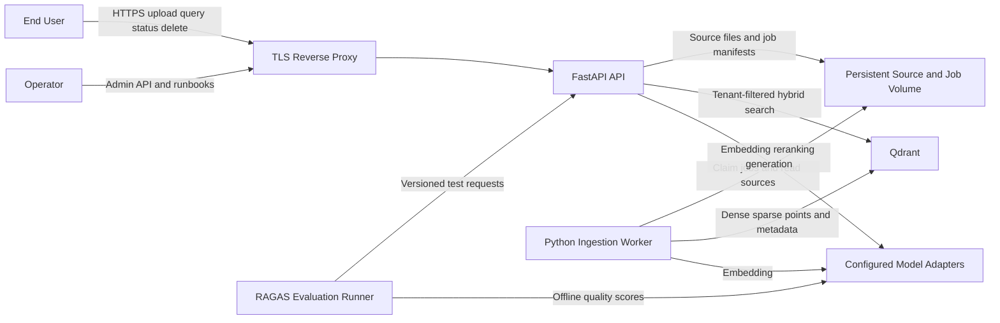
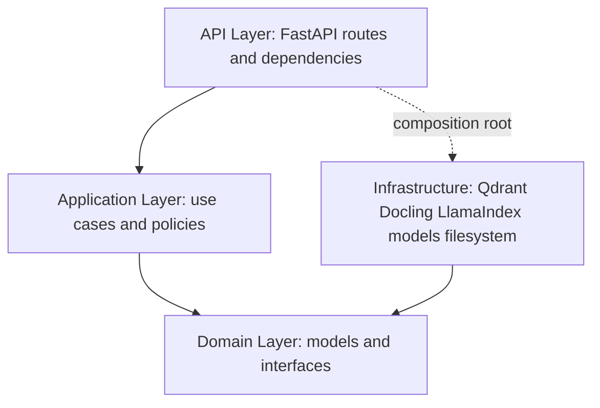
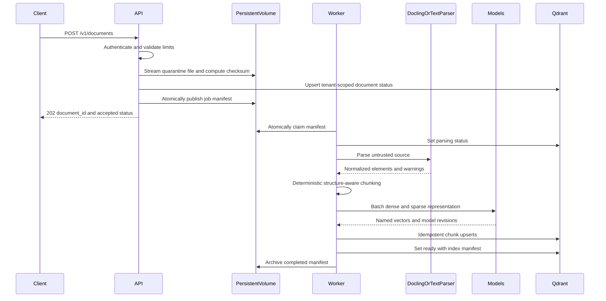
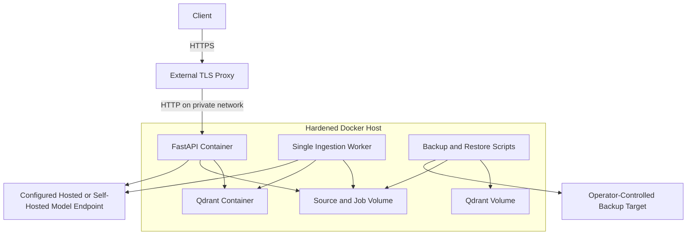
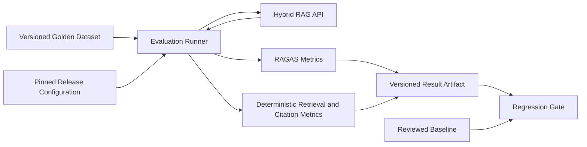

# Hybrid RAG Engine — Architecture and Engineering Decisions

## 1. Executive Summary

The Hybrid RAG Engine is a multi-tenant FastAPI service for ingesting complex
documents and answering questions from verifiable evidence. It combines dense
semantic retrieval and sparse keyword retrieval in Qdrant, fuses their rankings,
reranks the strongest candidates with a BGE cross-encoder, and asks a configurable
LLM to produce a Pydantic-validated answer with citations.

The architecture optimizes first for tenant isolation, answer grounding,
reproducibility, and operability. It deliberately targets a hardened single-host
Docker deployment for version 1. That is a real production boundary, not a claim of
high availability. The selected stack does not include a distributed work queue,
relational control plane, object store, identity provider, or observability backend;
their absence is made explicit so application code does not simulate guarantees it
cannot provide.

The phase-wise build and release gates are in
[IMPLEMENTATION_PLAN.md](IMPLEMENTATION_PLAN.md).

## 2. Architectural Drivers

The decisions in this document follow these priorities, in order:

1. No cross-tenant document or retrieval access.
2. No unsupported answer presented as grounded.
3. Deterministic, repeatable ingestion and index versioning.
4. Measurable retrieval and answer quality.
5. Graceful degradation when reranking or generation fails.
6. Bounded latency, memory, file size, and model concurrency.
7. Replaceable model providers without replaceable domain logic.
8. Recoverable deployment and reversible index upgrades.

## 3. System Context



Trust boundaries:

- TLS termination and network policy are deployment responsibilities outside the
  application container.
- Every non-health API request crosses an authentication boundary.
- Uploaded documents and their content are untrusted.
- Model output is untrusted until schema and citation validation succeed.
- Qdrant payload filters are defense in depth, not a substitute for API authorization.

## 4. Logical Components

### FastAPI API

Responsibilities:

- authenticate API keys and derive the authoritative tenant principal;
- validate request shape, size, filters, and configured limits;
- stream uploads to quarantine storage without loading whole files into memory;
- create document records and durable job manifests;
- provide document status, listing, deletion, retrieval, and query APIs;
- orchestrate retrieval, reranking, context assembly, generation, and validation;
- map internal failures to stable, versioned error responses;
- emit safe structured logs and metrics.

The API remains stateless except for bounded in-process concurrency and rate-limit
state. This supports process restart, but per-process rate limiting is not a
cluster-wide guarantee and must be replaced at the edge before horizontal API scale.

### Ingestion worker

Responsibilities:

- claim one durable filesystem job manifest at a time by atomic rename;
- parse, normalize, chunk, embed, and index a document;
- persist lifecycle transitions and safe failure details;
- resume or safely repeat work after interruption;
- remove quarantine data according to retention policy.

Version 1 runs a single worker. Idempotent point IDs protect against redelivery, but
the filesystem manifest protocol is not a distributed queue and does not provide
safe general-purpose multi-worker leasing.

### Domain and application layers

Project-owned interfaces define parsers, chunkers, embedders, rerankers, generators,
repositories, and retrieval indexes. Use cases depend on these interfaces. Concrete
Docling, LlamaIndex, Qdrant, BGE, and provider SDK code stays in infrastructure
adapters.

LlamaIndex is used for document/node representations and retrieval integration where
it reduces implementation risk. It does not own public API models, tenant policy,
job state, quality thresholds, or lifecycle orchestration.

### Qdrant

Qdrant stores:

- one point per chunk with named dense and sparse vectors;
- chunk text and citation metadata;
- tenant, document, content type, version, and filterable metadata payloads;
- small control collections for document status and hashed tenant-key records where
  required by the constrained stack.

Qdrant is not treated as a relational database. Cross-record transactional workflows
are avoided, and lifecycle reconciliation jobs repair partial states.

### Model adapters

The service has separate interfaces for:

- dense query/document embeddings;
- sparse query/document representation;
- cross-encoder reranking;
- answer generation;
- evaluation judge models used by RAGAS.

Each adapter reports a stable model identifier and revision. Production configuration
must pin revisions. A hosted or self-hosted implementation can be selected without
changing use-case code. Provider-specific features may not leak into public schemas.

### Evaluation runner

The RAGAS runner is an offline process, not part of request handling. It runs a
versioned dataset against a specified release, computes quality and retrieval
metrics, writes machine-readable results, and compares them with a reviewed baseline.

## 5. Layering and Dependency Direction



The domain layer imports no FastAPI, Qdrant, Docling, LlamaIndex, RAGAS, or provider
SDK modules. The application composition root wires concrete adapters. Automated
architecture tests enforce this boundary.

## 6. Ingestion Data Flow



### Ingestion invariants

- The authenticated principal supplies the tenant ID; request bodies never override it.
- A source is immutable for a document version.
- A document is queryable only when its status is `ready`.
- Chunk IDs are deterministic for an exact source and processing schema.
- Every point carries `tenant_id`, `document_id`, source checksum, source location,
  parser version, chunker version, embedding version, and index schema version.
- Indexing is at-least-once and idempotent.
- A terminal failure contains a safe code, not raw source content or a provider secret.
- Deletion is a lifecycle operation with verification, not only an HTTP acknowledgement.

### Document and chunk identity

Use UUIDv5 or a cryptographic digest mapped to a stable identifier:

```text
document_version_id = hash(
  tenant_id,
  source_checksum,
  parser_version,
  chunker_version,
  index_schema_version
)

chunk_id = hash(
  document_version_id,
  normalized_element_path,
  source_span,
  chunk_ordinal
)
```

The original filename is metadata and never participates in filesystem path
construction without sanitization.

### Parser output model

All parsers produce normalized elements with:

- element type such as heading, paragraph, table, table row, code, or log record;
- normalized text and optional structured cells;
- hierarchy path and stable ordinal;
- page, line, row/column, and bounding location when available;
- parser warnings and confidence where available;
- source checksum and parser revision.

This prevents retrieval and citation logic from depending on Docling-specific types.

### Chunking policy

The default chunker is structure-aware and token-bounded:

- headings remain attached to the content they describe;
- prose may use a small overlap to avoid boundary loss;
- tables repeat header context when split and preserve row ranges;
- log chunks preserve record order, timestamps, and severity boundaries;
- no chunk exceeds the configured model context-safe maximum;
- exact source spans remain available for citations.

Semantic-only chunking is not the default because it adds model cost, latency, and
nondeterminism during ingestion. It can be evaluated later on corpora where
structure-aware boundaries underperform.

## 7. Retrieval and Answer Data Flow

```mermaid
flowchart LR
    request["Authenticated Query"]
    queryValidation["Validate Question and Filters"]
    denseEmbed["Dense Query Embedding"]
    sparseEmbed["Sparse Query Representation"]
    denseSearch["Qdrant Dense Search"]
    sparseSearch["Qdrant Sparse Search"]
    fusion["Reciprocal-Rank Fusion"]
    dedupe["Deduplicate and Diversify"]
    rerank["BGE Cross-Encoder Rerank"]
    context["Evidence and Token Budget"]
    generate["Configured LLM"]
    validate["Pydantic and Citation Validation"]
    success["Cited Answer"]
    repair["One Constrained Repair"]
    abstain["Abstention or Typed Error"]

    request --> queryValidation
    queryValidation --> denseEmbed
    queryValidation --> sparseEmbed
    denseEmbed --> denseSearch
    sparseEmbed --> sparseSearch
    denseSearch --> fusion
    sparseSearch --> fusion
    fusion --> dedupe
    dedupe --> rerank
    rerank --> context
    context -->|"Sufficient evidence"| generate
    context -->|"Insufficient evidence"| abstain
    generate --> validate
    validate -->|"Valid"| success
    validate -->|"Invalid once"| repair
    repair --> validate
    validate -->|"Invalid after repair"| abstain
```



### Retrieval pipeline

1. Authenticate the request and construct Qdrant filters from the server-side tenant
   principal plus validated document and metadata constraints.
2. Generate dense and sparse query representations independently.
3. Retrieve bounded candidate lists from named vectors in the active collection.
4. Fuse ranks with reciprocal-rank fusion:

```text
rrf_score(document) = sum(1 / (k + rank_in_result_list))
```

5. Deduplicate by chunk ID and cap repeated chunks from one source before reranking.
6. Rerank a bounded candidate set with the BGE cross-encoder.
7. Apply evidence threshold, source diversity, and token-budget rules.
8. Send only the selected evidence and stable evidence IDs to generation.

Raw dense and sparse scores are not weighted together because their scales and
calibration differ. RRF is deterministic, explainable, and robust when one retriever
misses.

### Reranker degradation

If reranking times out or becomes unavailable:

- record a fallback event and metric;
- use fused ordering if the configured evidence threshold is met;
- return a warning in internal diagnostics;
- never widen tenant filters or candidate limits;
- fail the request when strict mode is configured for a high-assurance tenant.

### Grounding and citation validation

Retrieved text is delimited and explicitly treated as untrusted evidence. The model
must return a versioned structured object. Validation checks schema, field bounds,
status consistency, evidence ID membership, and tenant membership.

One repair attempt receives validation errors and the original allowed evidence IDs.
It may fix structure or citation references but cannot retrieve new content. A second
failure becomes a typed error. Insufficient evidence becomes an abstention, not an
LLM best guess.

## 8. Public API Shape

All endpoints except health checks live under `/v1` and require tenant authentication.
The exact request and response fields are defined in Pydantic and exported through
OpenAPI.

### Documents

- `POST /v1/documents` accepts one streamed file plus bounded metadata and returns
  `202 Accepted`, a document ID, and lifecycle status.
- `GET /v1/documents/{document_id}` returns tenant-scoped status, warnings, and
  processing versions.
- `GET /v1/documents` provides bounded cursor pagination and safe metadata filters.
- `DELETE /v1/documents/{document_id}` starts idempotent deletion and returns its
  lifecycle state.

### Retrieval and query

- `POST /v1/search` returns ranked evidence for debugging, integration, and
  retrieval-only clients. Detailed scores require an authorized diagnostic mode.
- `POST /v1/query` returns a cited `AnswerResponse`, an `abstained` response, or a
  typed error.

### Operations

- `GET /health/live` proves the process event loop is responsive.
- `GET /health/ready` proves required configuration and Qdrant are usable. It does
  not make a paid generation request.

### Error model

Errors include:

- stable machine-readable code;
- safe human-readable message;
- request ID;
- retryable boolean;
- optional bounded field violations.

Internal stack traces, provider payloads, API keys, source content, and tenant details
are never returned.

## 9. Multi-tenant Security Model

### Authentication

Version 1 uses high-entropy API keys. Only password-grade hashes are stored. A short
key identifier selects candidate records; constant-time verification checks the
secret. Keys have tenant, status, creation, expiration, and rotation metadata.

Bootstrap administration is provided through production secrets and a narrowly
scoped operator workflow. Production refuses example keys.

### Authorization

- The authentication dependency produces the only trusted tenant ID.
- Repository and retrieval methods require a `TenantPrincipal`, not a free-form
  optional tenant string.
- Every Qdrant read, update, scroll, delete, and count operation includes a tenant
  filter.
- Point IDs include tenant identity to make accidental collisions impossible.
- Document IDs from another tenant are returned as not found to avoid enumeration.
- Admin capabilities use separate keys and explicit scopes.

### Tenant isolation tests

A shared adversarial suite tests every storage method and API with:

- another tenant's document and point IDs;
- omitted, empty, repeated, and malformed filters;
- forged tenant metadata;
- delete, list, count, search, and status operations;
- collection aliases during reindex.

Any isolation failure blocks release regardless of aggregate quality metrics.

### Untrusted content controls

- Uploads are streamed, size-limited, signature-checked, and processed outside the
  request path.
- Parser execution has time, memory, and page/row/line limits.
- File paths are generated from server IDs.
- Document instructions cannot modify system prompts or authorization.
- Retrieved content is never executed as code or interpreted as a tool call.
- Logs redact credentials and omit raw content by default.

### Known security boundary

API keys provide service authentication, not enterprise single sign-on or per-user
authorization. If SSO, fine-grained ACLs, legal holds, or external key management are
required, they trigger a control-plane architecture revision rather than ad hoc
extensions to Qdrant payloads.

## 10. Qdrant Data Design

### Versioned chunk collections

Use immutable physical collection names and one stable alias:

```text
hybrid_chunks_v{schema_version}_{build_id}
hybrid_chunks_current -> hybrid_chunks_v{schema_version}_{build_id}
```

Each chunk point contains named `dense` and `sparse` vectors. Payload indexes exist
for high-selectivity fields used in production filters. Arbitrary user metadata is
not automatically indexed.

Required payload fields:

- `tenant_id`;
- `document_id` and `document_version_id`;
- `chunk_id`;
- `status`;
- `content_type`;
- `text`;
- source location and hierarchy;
- checksum;
- parser, chunker, dense, sparse, and schema versions;
- bounded, allowlisted user metadata.

### Control collections

Small collections hold document lifecycle and tenant API-key hash records because the
specified infrastructure excludes a transactional control database. Their use is
restricted to simple point reads/upserts and reconciliation-friendly state.

This is an intentional compromise:

- do not implement joins or multi-record transactions;
- make state transitions repeatable;
- retain filesystem manifests as ingestion recovery evidence;
- run reconciliation for stale states and point-count mismatches;
- introduce a transactional control store when workflow or identity requirements
  exceed these constraints.

### Delete behavior

Deletion uses tenant plus document filters, removes matching chunks, removes source
and derived files, marks control state, and verifies that retrieval/count returns no
active points. Backups retain data until their documented expiration; deletion
responses must state that retention boundary accurately.

### Index migration

Any incompatible parser, chunker, vector dimension, sparse representation, payload
schema, or model change creates a new physical collection. The worker reindexes from
immutable source files, validation checks run, and the stable alias switches
atomically. The old collection is retained for a bounded rollback window.

## 11. Failure Handling

### Retry policy

Retry only transient operations, with exponential backoff, jitter, attempt limits,
and an overall deadline. Do not retry authentication, unsupported files, validation
errors, content-limit violations, or deterministic parser failures.

### Ingestion recovery

- Job manifests are written to a temporary name, flushed, then atomically renamed.
- Claiming moves a manifest from pending to processing.
- Startup recovery moves stale processing manifests back to pending after verifying
  no active worker owns them.
- Stage outputs use deterministic paths and IDs.
- Exhausted jobs enter `failed` with a safe reason and remain inspectable.
- A reconciliation command compares manifests, document status, and indexed points.

### Query degradation

- Dense failure plus sparse success may continue only if configured quality gates are
  met; the inverse is also true.
- Reranker failure may fall back to fused ordering.
- Generation failure does not return retrieval text as if it were a generated answer.
- Invalid citations or output become repair then typed failure.
- Qdrant unavailability makes readiness fail and query endpoints return retryable
  dependency errors.

## 12. Deployment Topology



### Container requirements

- pinned base-image digests and dependency lock;
- multi-stage builds with development tools excluded from runtime;
- non-root users and dropped Linux capabilities;
- read-only root filesystem where parser/model caches permit;
- explicit writable volumes and temporary directories;
- CPU, memory, process, and file-descriptor limits;
- liveness/readiness checks and graceful termination deadlines;
- no secrets in image layers, Compose files, or logs;
- separate API and worker images even if they share a Python package.

### Availability statement

The initial topology has host, Qdrant, and volume single points of failure. Backups
and restart automation improve recovery, not availability. A requirement above the
99.5% target or for zero-downtime host maintenance triggers a multi-node design with
external durable storage and queueing. Those components require an approved stack
expansion.

## 13. Configuration and Versioning

All environment-specific values enter through Pydantic settings. Configuration is
validated at startup and secrets use runtime injection.

Every answer and evaluation record carries:

- application revision;
- collection alias target and index schema version;
- parser and chunker versions;
- dense, sparse, reranker, generator, and judge model revisions;
- prompt version;
- retrieval limits and fusion/rerank configuration;
- evaluation dataset and metric versions when applicable.

Changes to these values are reviewed like code. Floating model versions are
prohibited in production.

## 14. Observability

### Structured events

Each request and job has a correlation ID. Events include pseudonymous tenant ID,
document/job ID where relevant, stage, duration, result code, retry count, and active
versions. Raw content, prompts, answers, API keys, embeddings, and provider payloads
are excluded by default.

### Required signals

API:

- request rate, error rate, and latency by route/status;
- authentication failures, body-limit rejection, rate limiting, and timeout;
- active requests and model concurrency.

Ingestion:

- pending job count and oldest age;
- duration and failures by parse, chunk, embed, and index stage;
- pages/elements/chunks and chunk-size distributions;
- retries, stale jobs, warning rate, and unsupported files.

Retrieval and generation:

- dense, sparse, fusion, rerank, context, generation, and total latency;
- candidate counts and filtered counts;
- empty retrieval, low-evidence, abstention, reranker fallback, repair, and invalid
  citation rates;
- provider failures and token usage where available.

Storage and release:

- Qdrant readiness, collection size, point count, disk utilization, and active alias;
- source/job volume utilization;
- backup age, backup failure, restore-test age, and deployed version manifest.

### Privacy

Diagnostic content logging is disabled by default. A time-bounded, access-controlled
debug mode may record sanitized samples only with tenant approval and a documented
retention period.

## 15. Evaluation Architecture



RAGAS faithfulness, context recall, and answer relevancy are useful but may vary with
judge models. They are never the only gate. Deterministic retrieval, citation,
abstention, isolation, latency, and error metrics provide complementary evidence.

The golden set is segmented by document type, query type, tenant, answerability, and
difficulty. Aggregate gains cannot hide a severe regression in a critical segment.
Baseline changes require dataset review and manual output sampling.

## 16. Engineering Decision Records

Each decision includes the choice, rationale, trade-off, mitigation, and a trigger to
revisit it.

### ADR-001 — Qdrant instead of pgvector

**Choice:** Use Qdrant as the single retrieval engine.

**Why:** Named dense and sparse vectors, payload filtering, batch upsert, and
collection aliases directly support hybrid retrieval and safe reindexing without
building two ranking systems.

**Trade-off:** pgvector would colocate vectors with transactional metadata and use
familiar SQL operations. Qdrant does not replace a relational control plane, and the
allowed stack leaves job and identity workflows intentionally simple.

**Mitigation:** Keep control records minimal, make workflows idempotent, retain
durable filesystem manifests, and provide reconciliation and backup procedures.

**Revisit when:** identity/ACL workflow needs transactions, ingestion requires
multiple concurrent workers, complex reporting is required, or another system of
record must participate atomically.

### ADR-002 — LlamaIndex instead of LangChain

**Choice:** Use LlamaIndex selectively for document/node and retrieval integration.

**Why:** Its indexing and retrieval abstractions fit this project's center of gravity
and reduce adapter code around Qdrant.

**Trade-off:** Framework abstractions can conceal query parameters and create upgrade
coupling. LangChain has a broader general-purpose ecosystem but would not remove the
need for project-specific tenant, lifecycle, and quality policy.

**Mitigation:** Own all public/domain models and interfaces; pin versions; test
generated Qdrant filters and retrieval behavior against a real container.

**Revisit when:** framework upgrades repeatedly block model/store updates, critical
Qdrant features require bypasses, or direct adapters become smaller and clearer.

### ADR-003 — Docling as the primary complex-document parser

**Choice:** Use Docling for PDFs and complex tables, with dedicated bounded parsers
for text, Markdown, CSV, and logs.

**Why:** Layout and table structure are first-class retrieval and citation inputs;
plain text extraction discards information needed for enterprise documents.

**Trade-off:** Docling has a larger image, heavier CPU/memory use, and more failure
modes than a basic PDF text library.

**Mitigation:** Keep parsing asynchronous, set resource/page/time limits, version
parser output, maintain golden fixtures, and expose warnings and terminal failures.

**Revisit when:** production document types show poor extraction, parser resource cost
violates ingestion targets, or another allowed parser wins a representative bake-off.

### ADR-004 — Structure-aware deterministic chunking

**Choice:** Chunk by normalized document structure with token bounds and
content-specific overlap rules.

**Why:** It preserves headings, table headers, log records, and exact citation spans
while remaining deterministic and testable.

**Trade-off:** Semantic splitting can find topic boundaries that document layout
misses, while fixed-size splitting is simpler and faster.

**Mitigation:** Measure retrieval by document/query segment, tune structure rules,
and preserve normalized elements so alternative chunkers can reindex the same source.

**Revisit when:** retrieval errors are consistently caused by topic boundary splits
and semantic chunking improves quality enough to justify model cost and variability.

### ADR-005 — Sparse plus dense retrieval with RRF

**Choice:** Run Qdrant dense and sparse searches and combine their ranks with RRF.

**Why:** Dense search handles paraphrase and concepts; sparse search handles exact
identifiers, error strings, names, and table values. RRF avoids invalid raw-score
comparison.

**Trade-off:** Two retrieval paths add indexing, storage, latency, and tuning cost.
Weighted score fusion can outperform RRF after careful calibration.

**Mitigation:** Execute searches concurrently, bound candidates, benchmark each stage,
and retain dense-only/sparse-only ablations in evaluation.

**Revisit when:** one path contributes negligible quality, latency budgets are missed,
or enough labeled data exists to calibrate a superior fusion method safely.

### ADR-006 — BGE cross-encoder reranker by default

**Choice:** Rerank a small fused candidate set with a pinned BGE cross-encoder behind
a provider-neutral adapter.

**Why:** A cross-encoder jointly evaluates question and passage and typically orders
top candidates more precisely than independent embedding similarity.

**Trade-off:** It adds model memory, compute, latency, batching constraints, and
another failure mode. A hosted reranker may be operationally easier but adds data
egress, cost, and dependency.

**Mitigation:** Bound rerank candidates and text length, batch requests, record model
revision, benchmark latency, and fall back to fused ranking with an observable signal.

**Revisit when:** measured ranking lift does not justify latency/cost, model hardware
is unavailable, or a configured hosted adapter wins the accepted evaluation.

### ADR-007 — Provider-neutral model interfaces

**Choice:** Select hosted or self-hosted embedding, reranking, generation, and judge
adapters through configuration.

**Why:** Organizations differ on privacy, latency, cost, and model-hosting policy.
Provider choice must not force domain or API changes.

**Trade-off:** A lowest-common-denominator interface cannot expose every proprietary
feature and requires contract tests for each adapter.

**Mitigation:** Keep interfaces task-specific rather than generic, support capability
declarations, reject incompatible startup configuration, and permit carefully scoped
adapter extensions that do not leak into public contracts.

**Revisit when:** one provider is contractually fixed and its unique features deliver
a demonstrated quality or operational advantage.

### ADR-008 — Pydantic validation, one repair, then abstain or fail

**Choice:** Validate every generated response and citation; allow one constrained
repair attempt.

**Why:** Model JSON mode alone does not prove semantic consistency or citation
membership. Unlimited repair loops increase latency and can still fabricate evidence.

**Trade-off:** Strict validation increases visible abstentions/errors and one repair
adds cost.

**Mitigation:** distinguish insufficient evidence from malformed output, expose typed
status, evaluate abstention quality, and fix recurrent schema failures in prompts or
adapters rather than adding retries.

**Revisit when:** a provider offers a demonstrably reliable structured-output
contract and live metrics show repair is redundant.

### ADR-009 — RAGAS plus deterministic metrics

**Choice:** Use RAGAS offline for faithfulness, context recall, and answer relevancy,
paired with deterministic retrieval, citation, isolation, abstention, latency, and
error metrics.

**Why:** RAG quality is multidimensional and unit tests cannot measure semantic
grounding. RAGAS provides useful standardized signals.

**Trade-off:** Judge-model metrics are costly and nondeterministic and can be biased
by model choice. A single threshold can create false confidence.

**Mitigation:** pin judge/configuration, version datasets, retain per-example results,
use tolerances/confidence intervals, segment reports, and require manual review for
baseline changes.

**Revisit when:** metric correlation with human judgment is poor or domain-specific
expert scoring becomes available.

### ADR-010 — Single worker with durable filesystem manifests

**Choice:** Use one Python worker and atomic manifests on a persistent Docker volume.

**Why:** FastAPI background tasks can disappear on restart, while the specified stack
does not include a transactional message broker. Manifests provide inspectable,
recoverable work without pretending to be a distributed queue.

**Trade-off:** One worker limits throughput and the shared volume anchors the initial
deployment to one host.

**Mitigation:** batch model/index operations, make all stages idempotent, monitor job
age, support safe restart, and document the throughput ceiling.

**Revisit when:** queue age violates SLOs, more than one concurrent worker is needed,
or multi-host/high-availability deployment is required. At that point, expand the
approved stack rather than inventing distributed locks in Qdrant.

### ADR-011 — Single-host Docker production boundary

**Choice:** Ship version 1 as API, worker, and Qdrant containers on a hardened host
with persistent volumes, backup, restore, and external TLS.

**Why:** It is reproducible, operable with the specified stack, and proportionate to
an initial release while preserving service boundaries.

**Trade-off:** It has host, storage, and Qdrant single points of failure and cannot
claim high availability or multi-region resilience.

**Mitigation:** define 99.5% availability, backup and restore targets, monitor
capacity, retain rollback artifacts, and state the boundary in release documentation.

**Revisit when:** availability exceeds 99.5%, maintenance cannot tolerate downtime,
recovery targets tighten, or measured load exceeds one host.

### ADR-012 — Multi-tenant shared collections with mandatory payload filters

**Choice:** Store tenant chunks in shared versioned collections and apply mandatory
tenant filters to every operation.

**Why:** One collection per tenant creates operational and index-management overhead
that grows with tenant count. Shared collections simplify reindex and model upgrades.

**Trade-off:** A missing filter can cause severe data leakage, and noisy tenants share
resources.

**Mitigation:** require tenant principals in repository signatures, centralize filter
construction, use tenant-derived point IDs, run adversarial tests for every operation,
apply quotas, and monitor tenant-level usage.

**Revisit when:** contractual isolation requires dedicated storage, a tenant dominates
capacity, or Qdrant operational guidance for the measured tenant count changes.

## 17. Explicit Limitations and Scale Triggers

The architecture must be revised before claiming any of the following:

- high availability across hosts or regions;
- horizontally scaled ingestion workers;
- enterprise SSO or per-user document ACLs;
- transactional billing, quotas, workflows, or audit ledgers;
- globally consistent API rate limits;
- immutable external object storage or legal-hold semantics;
- centralized metrics/tracing without an approved observability backend.

Trigger an architecture review when:

- oldest ingestion job exceeds the agreed SLO for a sustained period;
- Qdrant/source disk exceeds 70% after compaction and retention actions;
- query p95 or model concurrency misses budget under representative load;
- backup restore exceeds the four-hour RTO;
- one tenant requires dedicated capacity or storage isolation;
- product requirements add workflows that need multi-record transactions;
- release quality cannot be explained from recorded versions and evaluation data.

## 18. Production Readiness Checklist

### Security

- Production keys and secrets are injected and rotated; no examples remain active.
- Every non-health endpoint and storage method passes tenant-isolation tests.
- Upload limits, parser limits, prompt-injection defenses, log redaction, and
  container hardening are verified.
- Dependency and image scans have no unaccepted critical findings.

### Reliability

- Duplicate ingestion, worker restart, Qdrant restart, model timeout, disk pressure,
  and graceful shutdown have been exercised.
- Backup completion is monitored and an isolated restore test meets RPO/RTO.
- Reindex alias switch and application rollback are rehearsed.

### Quality

- Golden dataset and baseline are reviewed and versioned.
- Hybrid retrieval and reranking beat accepted ablations within latency budget.
- Citation validity, abstention, RAGAS, deterministic retrieval, and segment metrics
  pass release policy.

### Operations

- SLO queries/signals, release manifest, dashboards or equivalent log queries, and
  alert ownership exist.
- Runbooks cover ingestion failure, Qdrant/model outage, restore, reindex, rollback,
  key rotation, tenant leakage, and tenant deletion.
- Capacity headroom and the single-host boundary are accepted by service owners.
